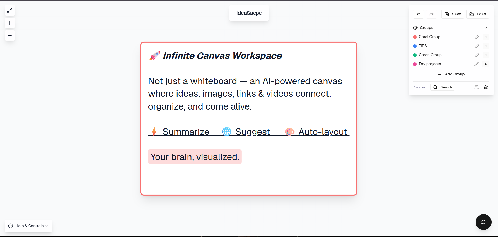

<div align="center">

# **IdeaScape**

### Infinite Spatial Ideation — Think Without Borders

[](https://react.dev)
[](https://vite.dev)
[](https://www.typescriptlang.org)
[](https://tailwindcss.com)
[](https://supabase.com)
[](https://openrouter.ai)

**IdeaScape** is a browser-based infinite canvas for spatial ideation — connect thoughts visually, organize with color-coded groups, and let AI surface the patterns you missed.

</div>

<div align="center">



*Figure 1 — typical UI (canvas, welcome card, groups, toolbars).*

</div>

---

## 🧠 Core Features

<table>
<tr>
<td width="50%">

### 🗺️ Infinite Canvas
Pan and zoom without limits. Nodes connect through smooth **Bezier curves**, and the entire workspace supports drag, resize, multi-select with box selection, and full undo/redo history.

</td>
<td width="50%">

### 📦 Multi-Modal Nodes
Five distinct node types — **Text**, **Image**, **Link**, **Video**, and **Interactive Browser** — each with rich editing. Image and video nodes support masonry galleries; link nodes manage multiple URLs; browser nodes embed live navigable sessions.

</td>
</tr>
<tr>
<td width="50%">

### 🤖 Spatial AI
Real-time AI suggestions powered by **OpenRouter**. Automatic connection discovery between related nodes, intelligent group naming, and content summarization — all running in the background through a dedicated AI slice.

</td>
<td width="50%">

### 🖨️ Pro Export
Clean capture pipeline for **PNG**, **JPEG**, and **PDF** with group legend overlays. Uses `html-to-image` for pixel-perfect rasterization and `jspdf` for document generation. Full JSON import/export for workspace portability.

</td>
</tr>
<tr>
<td width="50%">

### 🏷️ Organization
**Color-coded Groups** with customizable names and node assignments. **Tag-based filtering** lets you slice your canvas by topic — pin important nodes, annotate with comments, and toggle visibility per tag.

</td>
<td width="50%">

### 👥 Real-Time Collaboration
Live multi-user editing via **Supabase Realtime** channels. See live collaborator presence in real time, share canvases with a link, and sync state across sessions with presence awareness.

</td>
</tr>
</table>

---

## ⚙️ Tech Stack

| Layer | Technology | Role |
|-------|-----------|------|
| **Framework** | React 18 + Vite 6 | SPA with HMR, code-splitting, and optimized chunk strategy |
| **Language** | TypeScript | End-to-end type safety across components, stores, and services |
| **Styling** | Tailwind CSS 4 + Radix UI | Utility-first CSS with accessible, unstyled primitives (shadcn pattern) |
| **State** | Zustand | Single canonical store with slices — canvas state, AI state, and collaboration state |
| **AI** | OpenRouter API | Model-agnostic inference gateway — currently using DeepSeek Chat V3.1 |
| **Backend** | Supabase | Auth, Realtime channels for collaboration, and edge functions for browser sessions |
| **Export** | html-to-image + jspdf | Rasterization and PDF generation with vendor chunk isolation |
| **Testing** | Vitest + jsdom | Lightweight smoke tests for store integrity |
| **Animation** | Motion (Framer Motion) | Smooth transitions for node creation and UI interactions |
| **UI Components** | Radix + CVA + cmdk | Accessible dialogs, menus, command palette, and 40+ primitives |

---

## 🚀 Getting Started

### Prerequisites

- **Node.js** 18+ and **npm** (or pnpm)
- An **OpenRouter** API key — [get one free](https://openrouter.ai/keys)
- A **Supabase** project (optional — required only for collaboration features)

### Install & Run

```bash
# Clone the repository
git clone https://github.com/your-username/ideascape.git
cd ideascape

# Install dependencies
npm install

# Start the dev server
npm run dev
```

The app will be available at `http://localhost:5173`.

### Environment Configuration

IdeaScape uses **environment variables** for all API credentials. Keys are never hardcoded and never shipped to the browser.

1. **Create a `.env.local` file** in the project root (copy from `.env.example`):

```bash
cp .env.example .env.local
```

2. **OpenRouter** (legacy — currently unused, NVIDIA is the default provider):

```
OPENROUTER_API_KEY=sk-or-v1-your-key-here
```

3. **NVIDIA NIM** (primary AI provider):

```
NVIDIA_API_KEY=nvapi-your-key-here
NVIDIA_BASE_URL=https://integrate.api.nvidia.com/v1
```

4. **Supabase** (optional — for collaboration): Configure `NVIDIA_API_KEY` and `APP_ALLOWED_ORIGIN` in your Supabase Edge Function secrets.

> **Never commit `.env.local` or any file containing real API keys.** All `.env*` files are gitignored.

### Scripts

| Command | Description |
|---------|-------------|
| `npm run dev` | Start Vite dev server with HMR |
| `npm run build` | Production build with optimized chunks |
| `npm test` | Run Vitest smoke tests |

---

## 🏗️ Architecture

```
src/
├── main.tsx                          # React root entry
├── styles/                           # Global CSS, themes
└── app/
    ├── App.tsx                       # Shell — canvas, toolbars, autosave, toasts
    ├── store/
    │   ├── canvasStore.ts            # Zustand store — nodes, connections, groups, history
    │   └── canvasStore.test.ts       # Vitest smoke tests
    ├── stores/
    │   ├── slices/aiSlice.ts         # AI state — suggestions, summarization, group naming
    │   └── collaborationStore.ts     # Supabase realtime — presence, sync, sharing
    ├── components/
    │   ├── InfiniteCanvas.tsx        # Pan/zoom canvas with selection and connections
    │   ├── CanvasNode.tsx            # Node renderer — type-specific content dispatch
    │   ├── Connection.tsx            # Bezier curve edge rendering
    │   ├── BrowserNode.tsx           # Embedded browser with navigation and capture
    │   ├── Toolbar.tsx               # Desktop toolbar — export, actions
    │   ├── AISuggestionsPanel.tsx    # AI suggestion surface
    │   ├── GroupDialog.tsx           # Group creation and management
    │   ├── TagManager.tsx            # Per-node tag editing
    │   ├── CommandPalette.tsx        # cmdk-powered command palette
    │   ├── NodeSearchDialog.tsx      # Search and filter nodes
    │   └── ui/                       # 40+ Radix/shadcn primitives
    ├── services/
    │   ├── aiService.ts              # OpenRouter integration and prompt engineering
    │   └── browserSessionService.ts  # Browser node session persistence
    └── utils/supabase/               # Supabase client configuration
```

---

## 📋 Development Roadmap

### Recent Wins

- **Refactored safety layers** — Error boundaries and resilient state management protect against cascading failures
- **Vitest smoke tests** — Store integrity tests validate node CRUD, connections, groups, undo/redo, and command stats
- **New export pipeline** — Unified PNG/JPEG/PDF export with `html-to-image` and `jspdf`, isolated into a dedicated vendor chunk for fast loading
- **Collaboration system** — Supabase Realtime integration with presence, live state sync, and canvas sharing
- **Command palette** — Fuzzy search across all canvas actions with frequency-based ranking

### Up Next

- [ ] Migrate API keys to environment variables (`.env`)
- [ ] Expand test coverage to components and AI service
- [ ] Offline-first support with local persistence
- [ ] Canvas templates and starter layouts
- [ ] Plugin system for custom node types

---

## 📄 License

This project is private. See the repository settings for access details.

---

<div align="center">

**Built with spatial thinking in mind.**

*IdeaScape — where every idea finds its place.*

</div>
