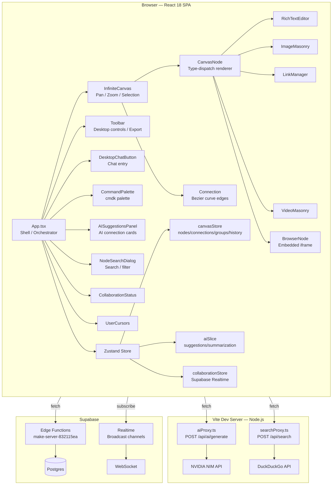

<!-- generated-by: gsd-doc-writer -->
# Architecture

## System Overview

IdeaScape is a browser-based infinite canvas SPA for spatial ideation. Users create, connect, and organize multi-modal nodes (text, image, link, video, browser) on an unbounded pan/zoom surface, with AI-powered suggestions surfacing connections the user might have missed. The application follows a **single-page client + dev-server middleware** architecture: the React 18 frontend handles all rendering and user interaction, while the Vite 6 dev-server hosts two reverse-proxy middleware handlers (`/api/ai/generate` and `/api/search`) that keep third-party API credentials server-side. A Supabase backend provides optional real-time collaboration via Realtime broadcast channels and Edge Functions. State is unified under a single Zustand store with domain slices (canvas, AI, collaboration).

## Component Diagram



## Data Flow

### Node Creation Flow
1. User presses `N` key or clicks toolbar "Add Node" button.
2. `App.tsx` keyboard handler calls `canvasStore.addNodeAtCenter()`.
3. Store computes center position from current transform: `(window.innerWidth / 2 - transform.x) / transform.scale`.
4. Store generates a unique ID (`node-{timestamp}-{random}`), creates a `Node` object with `type: 'text'` default content, pushes it to `nodes[]`, saves a history snapshot, and schedules an auto-save (debounced 100ms).
5. React re-render: `InfiniteCanvas` maps `nodes[]` to `<CanvasNode>` components positioned via CSS transform.
6. After 600ms, `isNew` flag is cleared (animation lifecycle).

### AI Suggestion Flow
1. User opens `AISuggestionsPanel` and clicks "Suggest Connections".
2. `aiSlice.suggestConnections()` gathers all node data and existing connections.
3. Calls `aiService.suggestConnections()` which POSTs to `/api/ai/generate` with a structured prompt.
4. Vite dev middleware (`aiProxy.ts`) receives the request, builds a provider config from `NVIDIA_API_KEY` + `NVIDIA_BASE_URL`, calls the NVIDIA NIM chat completions endpoint.
5. Response is parsed for content; if the primary model fails, a fallback rotation through available model IDs is attempted.
6. `aiService` extracts connection suggestions from the LLM response and returns them.
7. `aiSlice` updates `aiSuggestions.connections[]` in the store; `AISuggestionsPanel` re-renders with suggestion cards.
8. User clicks "Apply" on a suggestion → `applyConnectionSuggestion()` calls `canvasStore.addConnection()`.

### Auto-Save and Persistence Flow
1. A `setInterval` in `App.tsx` calls `canvasStore.autoSave()` every 30 seconds.
2. On `beforeunload`, `App.tsx` triggers an immediate `autoSave()`.
3. `autoSave()` serializes nodes (with rounded coordinates), connections, groups, transform, and settings to JSON.
4. Primary persistence target: `localStorage` under the key `mindmap-autosave`.
5. Secondary persistence target: IndexedDB database `ideascape-canvas` (documents store) — used when available for larger payloads.
6. On app startup, `App.tsx` calls `loadDurableSave()` which attempts IndexedDB first, falls back to localStorage (`loadAutoSave()`).
7. Storage cleanup runs asynchronously: old backups (>3) are pruned, entries older than 30 days are removed.

### Collaboration Sync Flow
1. User creates a collaborative canvas via `collaborationStore.createCollaborativeCanvas()`.
2. A POST request is sent to the Supabase Edge Function at `/functions/v1/make-server-832115ea/canvas/create`.
3. On success, the store subscribes to a Realtime broadcast channel (`canvas:{canvasId}`).
4. Local changes trigger `updateCanvasData()` → PUT to Edge Function.
5. Remote changes arrive via Realtime broadcast events (`canvas_update`, `presence_update`, `user_left`).
6. `UserCursors` component renders remote collaborator cursor positions from `participants[]`.

### Export Pipeline Flow
1. User selects export format (JSON/PNG/JPEG/PDF) in `Toolbar`.
2. **JSON**: `canvasStore.exportCanvas()` serializes canvas state to JSON → Blob download.
3. **PNG/JPEG**: `html-to-image` (`toPng` / `toJpeg`) rasterizes the canvas DOM element into an image Blob → download.
4. **PDF**: `html-to-image` → canvas → `jsPDF.addImage()` to produce a paginated PDF with a group legend overlay.
5. During export, transient UI elements (toolbars, chat buttons) are temporarily hidden, and the canvas transform is reset to ensure full capture.

## Key Abstractions

| Abstraction | Description | File |
|---|---|---|
| `Node` | Core data model for a canvas card: position, dimensions, content (type-discriminated union), group membership, tags, timestamps, pin/comment state | `src/app/store/canvasStore.ts` (line 11) |
| `Connection` | Directed edge between two nodes with configurable anchor points (`fromPoint`/`toPoint`) and color | `src/app/store/canvasStore.ts` (line 43) |
| `NodeGroup` | Named, color-coded container that owns a set of node IDs | `src/app/store/canvasStore.ts` (line 52) |
| `CanvasTransform` | Pan (`x`, `y`) and zoom (`scale`) state of the canvas viewport | `src/app/store/canvasStore.ts` (line 59) |
| `SelectionBox` | Rectangular multi-select region with start/end coordinates | `src/app/store/canvasStore.ts` (line 65) |
| `AISuggestionsState` | AI-generated connection proposals, group summaries, and group name suggestions with loading/error state | `src/stores/slices/aiSlice.ts` (line 31) |
| `UserPresence` | Remote collaborator metadata: userId, userName, cursor position, color | `src/app/stores/collaborationStore.ts` (line 11) |
| `CollaborativeCanvas` | Server-side canvas record with participants list and JSON data blob | `src/app/stores/collaborationStore.ts` (line 19) |
| `AIProxyRequest` | Request shape for the server-side AI proxy: messages array, model, temperature, streaming flag | `src/server/aiProxy.ts` (line 12) |
| `ProviderConfig` | AI provider connection configuration: baseUrl, apiKey, model, headers, extra body params | `src/server/aiProxy.ts` (line 45) |

## Directory Structure Rationale

```
src/
├── main.tsx                     # React root — mounts <App /> into #root
├── styles/                      # Global CSS entry point (index.css), theme definitions
├── types/                       # Ambient type declarations (e.g., react-draggable.d.ts)
├── server/                      # Vite dev-server middleware — NEVER shipped to browser
│   ├── aiProxy.ts               #   NVIDIA NIM API reverse proxy with rate limiting & fallback
│   ├── aiProxy.test.ts          #   Unit tests for proxy logic
│   └── searchProxy.ts           #   DuckDuckGo search proxy (no API key required)
├── stores/                      # Zustand slices (extracted for composability)
│   └── slices/
│       └── aiSlice.ts           #   AI suggestion state + actions, injected into canvasStore
└── app/                         # Application code
    ├── App.tsx                  # Root shell — layout, keyboard shortcuts, auto-save orchestration
    ├── store/
    │   ├── canvasStore.ts       #   Primary Zustand store — nodes, connections, groups, history, settings
    │   └── canvasStore.test.ts  #   Vitest smoke tests for store integrity
    ├── stores/
    │   └── collaborationStore.ts#   Supabase Realtime collaboration state + actions
    ├── components/              # React UI components
    │   ├── InfiniteCanvas.tsx   #   Canvas surface — pan/zoom/drag/selection
    │   ├── CanvasNode.tsx       #   Node renderer with type-specific content dispatch
    │   ├── Connection.tsx       #   Bezier curve edge with smart connection points
    │   ├── BrowserNode.tsx      #   Embedded iframe browser with navigation, bookmarks, history
    │   ├── Toolbar.tsx          #   Desktop toolbar — export, groups, settings, collaboration
    │   ├── CommandPalette.tsx   #   cmdk-powered command palette (Ctrl+K)
    │   ├── AISuggestionsPanel.tsx # AI suggestion cards with apply/dismiss actions
    │   ├── RichTextEditor.tsx   #   ContentEditable text editor for text nodes
    │   ├── ImageMasonry.tsx     #   Masonry gallery for image nodes
    │   ├── VideoMasonry.tsx     #   Video gallery for video nodes
    │   ├── LinkManager.tsx      #   Multi-URL manager for link nodes
    │   ├── ...                  #   ~30 more domain components
    │   └── ui/                  #   40+ shadcn/Radix primitives (button, dialog, dropdown, etc.)
    ├── services/                # Business logic and API clients
    │   ├── aiService.ts         #   AI client — prompt templates, response parsing
    │   ├── aiService.test.ts    #   AI service unit tests
    │   ├── canvasPersistence.ts #   IndexedDB persistence layer
    │   ├── enhancedAiService.ts #   Enhanced/alternative AI service
    │   ├── browserSessionService.ts # Browser node session + bookmark management
    │   └── canvasTools.ts       #   Canvas utility functions
    ├── utils/
    │   └── supabase/
    │       └── info.tsx         #   Supabase project ID and anon key
    └── supabase/
        └── functions/           #   Supabase Edge Functions (server-side)
```

Key organizational principles:
- **Server isolation**: `src/server/` is separated from `src/app/` to make it explicit that server middleware is never bundled into the client. These files run only in the Vite Node.js dev server.
- **Store separation**: The canvas store lives in `src/app/store/` as the primary store. The AI slice lives in `src/stores/slices/` and is composed into the canvas store via Zustand's `createAISlice()` pattern — keeping AI logic optional and testable. The collaboration store is independent (`src/app/stores/`).
- **Component co-location**: Domain components (`InfiniteCanvas`, `CanvasNode`, `Connection`) live in `components/` alongside their dependent child components (`RichTextEditor`, `ImageMasonry`, `BrowserNode`). Shared UI primitives from shadcn/Radix are in `components/ui/`.
- **Service layer**: All external API communication (AI, search, persistence) is abstracted into `services/` — components never call `fetch` directly to external endpoints.

## External Service Integration

| Service | Purpose | Integration Point | Credential |
|---|---|---|---|
| NVIDIA NIM | AI inference (chat completions, summarization, suggestions) | `src/server/aiProxy.ts` → POST `/api/ai/generate` | `NVIDIA_API_KEY`, `NVIDIA_BASE_URL` (env vars) |
| DuckDuckGo | Web search for AI context | `src/server/searchProxy.ts` → POST `/api/search` | None (free API) |
| Supabase | Auth, Realtime broadcast, Edge Functions, database | `src/app/stores/collaborationStore.ts` → `@supabase/supabase-js` | `publicAnonKey` (client-safe), env vars for Edge Function secrets |
| `html-to-image` | DOM rasterization for PNG/JPEG export | `src/app/components/Toolbar.tsx` | N/A (client library) |
| `jspdf` | PDF document generation for export | `src/app/components/Toolbar.tsx` | N/A (client library) |

## Testing Architecture

- **Framework**: Vitest 3.2 with jsdom environment.
- **Configuration**: `vitest.config.ts` — single-threaded pool, globals enabled, setup file `vitest.setup.ts`.
- **Test locations**: Test files are co-located with source files using the `*.test.ts` pattern:
  - `src/app/store/canvasStore.test.ts` — store CRUD, undo/redo, connections, groups, command stats
  - `src/server/aiProxy.test.ts` — AI proxy request/response handling
  - `src/app/services/aiService.test.ts` — AI service prompt building and response parsing
<!-- GENERATED BY GSD DOC WRITER. Do not edit manually. -->